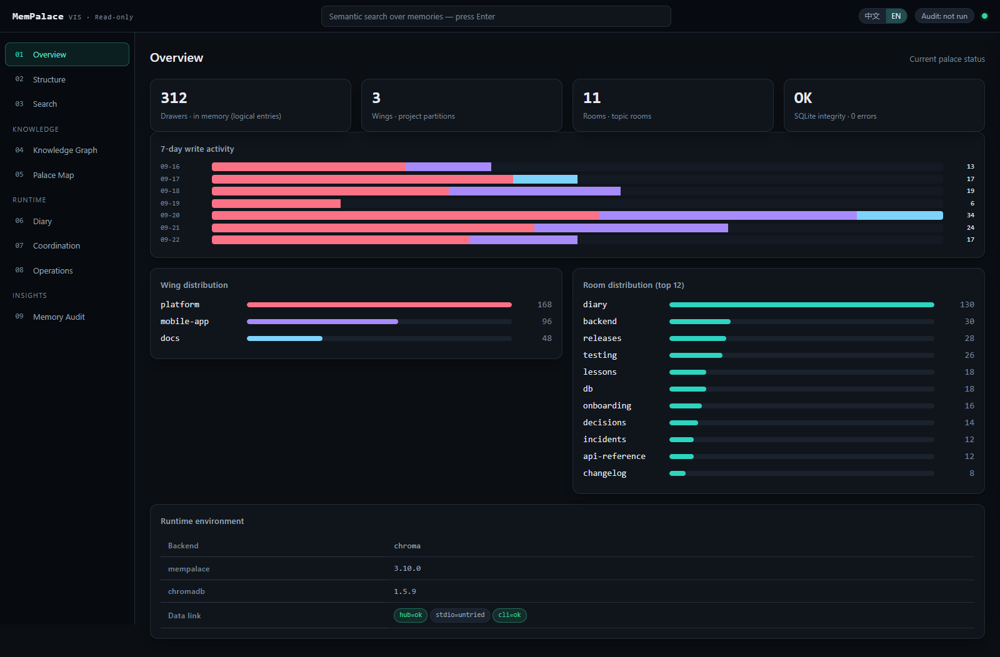
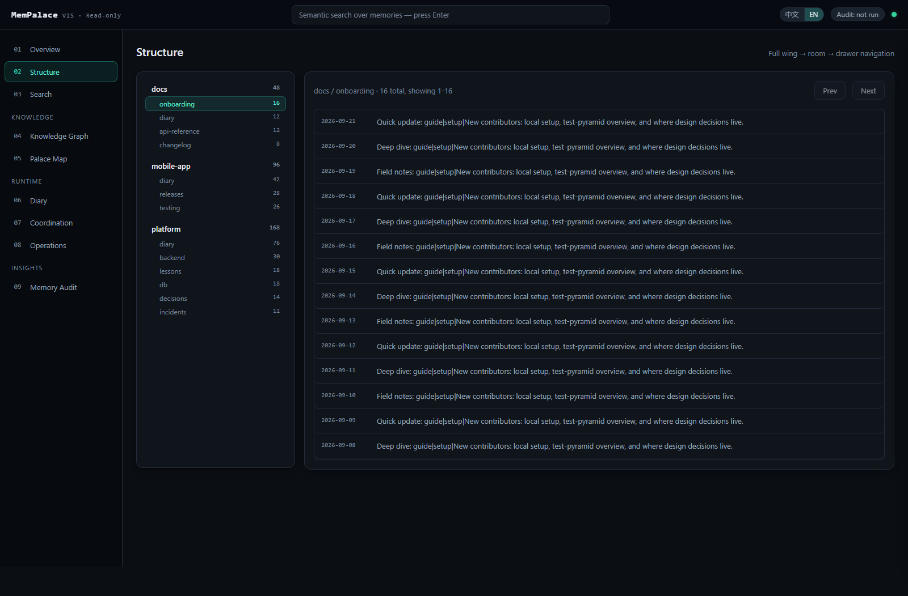
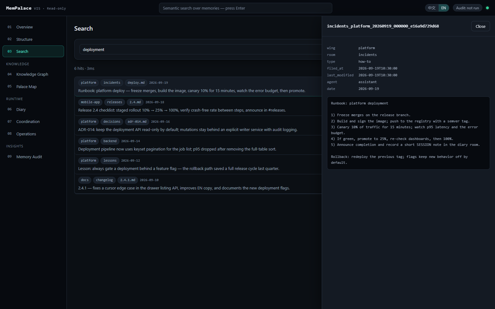
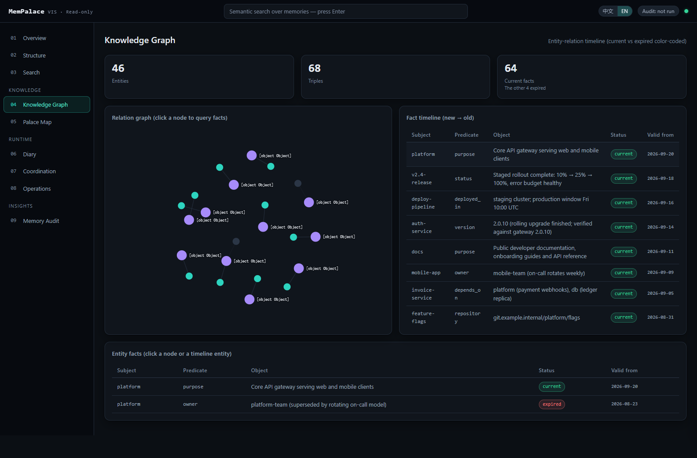
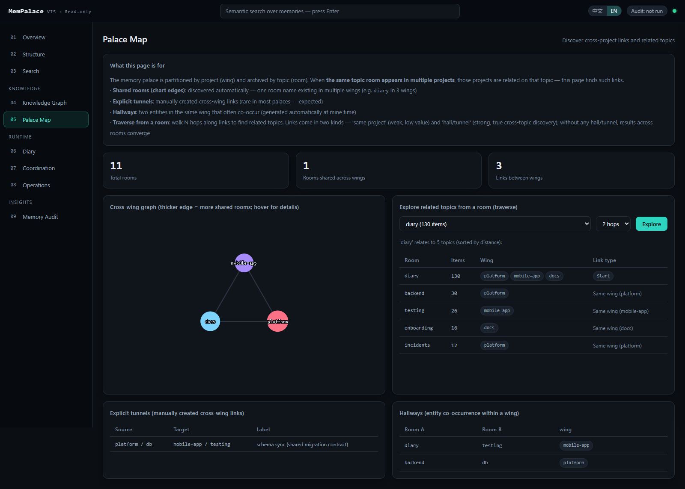
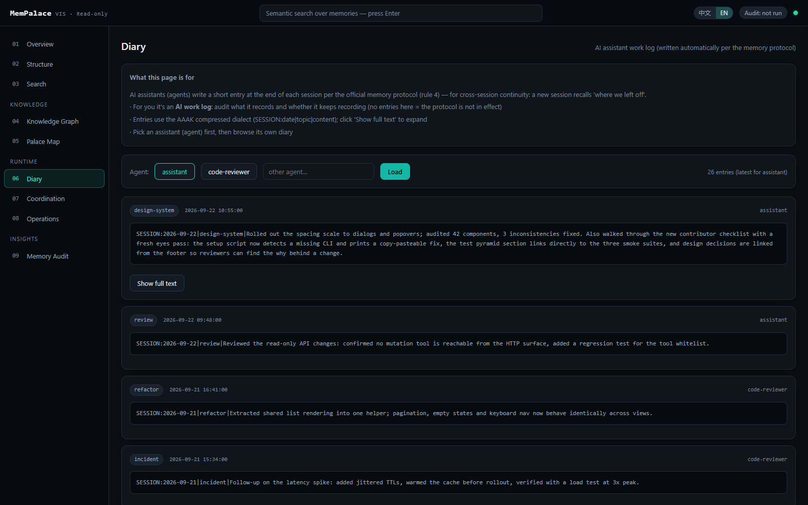
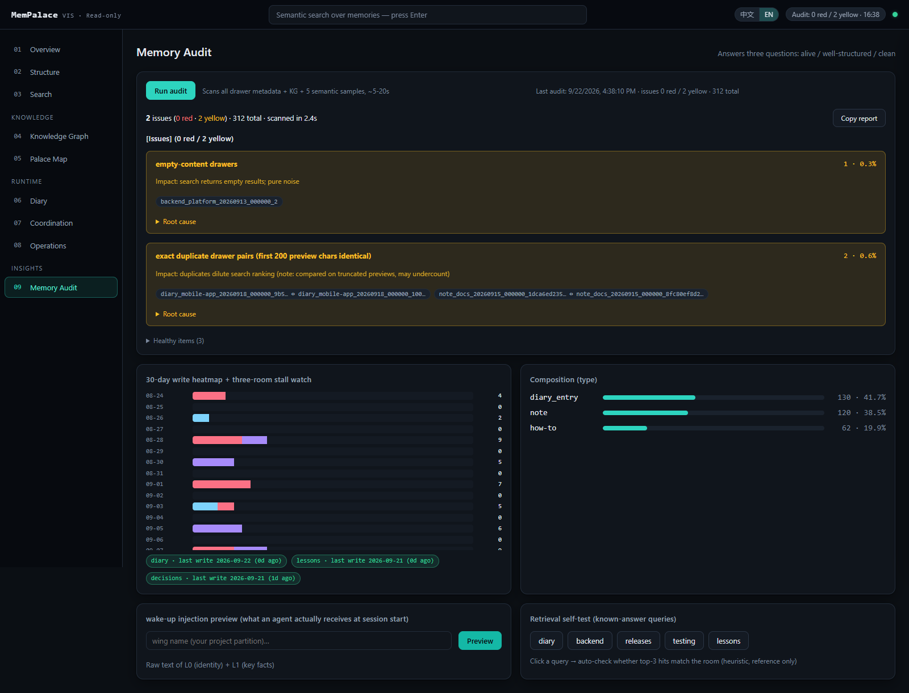

# MemPalace 可视化管理台


给 [MemPalace](https://github.com/MemPalace/mempalace) 的本地只读可视化管理台——把记忆宫殿的状态、检索、知识图谱与运维健康从"黑箱"变成浏览器里可观察、可验证的界面。

> **只读保证**：本工具只调用 MemPalace 的官方只读接口（MCP 只读工具白名单 + 只读 CLI 命令），代码中不存在任何写工具调用路径（仓库内有自动化审计脚本用例验证）。删抽屉、改图谱等操作请走 MemPalace 自身的 MCP/CLI。

## 功能（9 个区块）

| 区块 | 内容 |
|---|---|
| 总览 | drawer/wing/room 计数、7 日写入活动、分布条形、版本与完整性、数据链路状态 |
| 结构浏览 | wing→room→drawer 树导航、分页列表、全文+元数据详情侧滑 |
| 语义搜索 | 向量检索、similarity 排序、wing/room/source 归属展示、点开详情 |
| 知识图谱 | 实体-关系力导向图（现行/过期分色）、时间线、实体事实查询 |
| 宫殿导航图 | wing 规模图、tunnels/hallways、任意房间 traverse 探索 |
| Diary | 各 agent 的 AAAK 日记时间线 |
| 协调域 | logstream 事件流（RFC 003）、artifact 工件查看 |
| 运维健康 | repair-status、备份自动发现与新鲜度（官方 `.backup` 目录 / `max-seq-id` 备份文件 + 可选自定义目录）、宫殿体积（chroma / sqlite_exact 兼容）；hub.log 卡片为可选配置（未配置时自动隐藏） |
| **记忆体检** | 一键体检：问题清单（问题/数量/占比/影响→原因→正常项）、30 天写入热力、三通道停写警报、wake-up 注入预览（agent 会话开始实际收到的内容）、数据构成分析、重复/空内容检测、KG 过期占比、检索质量自测 |

## 界面预览

> 截图基于**全演示数据**（虚构内容）生成，不包含任何真实记忆。

| | |
|---|---|
| **总览**<br> | **结构浏览**<br> |
| **语义搜索 + 抽屉详情**<br> | **知识图谱**<br> |
| **宫殿导航图**<br> | **Diary**<br> |
| **记忆体检**<br> | |

## 快速开始

```bash
# 1) 安装（任选平台）
python -m venv .venv
.venv/bin/pip install -r requirements.txt        # macOS/Linux
# .venv\Scripts\pip install -r requirements.txt  # Windows

# 2) 启动
./start_viz.sh            # macOS/Linux
# 或 Windows: 双击 start_viz.cmd

# 3) 打开 http://127.0.0.1:8766
```

前置要求：**Python 3.10+**；本机已安装 mempalace CLI（在 PATH 中，或通过配置文件指定路径），并已 mine 过内容。

**让 AI 帮你配**：仓库自带 `AGENTS.md`（面向 coding agent 的安装/配置/验证指南）——直接对你的 AI 助手说"读 AGENTS.md 按步骤配置这个项目"即可。

**验证安装**：`curl -s http://127.0.0.1:8766/api/overview` 应返回包含 `total_drawers` 的 JSON；`pytest` 应全绿。可选：`pip install playwright` 后跑 `tests/browser_smoke.py`（9 视图无错误）、`tests/interaction_smoke.py`（14 项交互流）与 `tests/i18n_smoke.py`（中英文切换，6 项）——浏览器启动链为：本机 Edge（Windows 标准路径）→ msedge channel → Playwright 自带 chromium（无 Edge 环境先执行 `playwright install chromium`），三大平台均可运行。

**中英文切换**：界面支持中文 / English。检测顺序：手动选择（localStorage 记忆）优先；否则看浏览器语言——含中文（zh*）默认中文，其余（含识别不到）默认英文。右上角「中文 / EN」随时手动切换，切换后立即生效且被记住。后端用户可见的少量错误文案随请求头 `Accept-Language` 切换。

**常见问题**：端口 8766 被占用时，在 `mempalace_viz.json` 改 `port`；远程机器请用 SSH 隧道访问（`ssh -L 8766:127.0.0.1:8766 user@host`），本工具无鉴权、默认只绑 127.0.0.1，不要绑 0.0.0.0。

## 可选配置

复制 `mempalace_viz.example.json` 为 `mempalace_viz.json`（gitignored）：

```json
{
  "palace": null,           // 宫殿路径；null = 官方解析链（MEMPALACE_PALACE 环境变量 > ~/.mempalace/config.json > ~/.mempalace/palace）
  "mempalace_exe": null,    // CLI 路径；null = PATH 里 which() 自动发现
  "mempalace_mcp_exe": null,
  "hub_log": null,          // 本机 hub 日志路径；null = 对应卡片隐藏
  "backup_dir": null,       // 备份目录；null = 对应卡片隐藏
  "port": 8766
}
```

## 架构

```
浏览器（原生 JS + 本地 ECharts，无构建链、无 CDN）
  → FastAPI 只读端点（21 个 /api/*）
  → 三级降级数据链：
     ① 直连 mempalace hub（官方 serverinfo.json 发现 + token 认证，/mcp JSON-RPC）
     ② 降级 spawn mempalace-mcp.exe stdio（带超时）
     ③ 再降级 CLI 文本命令（repair-status / wake-up）
```

设计决策：贴官方接口而非解析内部存储（MemPalace 升级不坏）；只读连接与写者并发安全（官方 3.10 起 read-only 支持）。

## 测试

```bash
.venv/bin/python -m pytest          # 或 .venv\Scripts\python.exe -m pytest
```

## License

MIT
